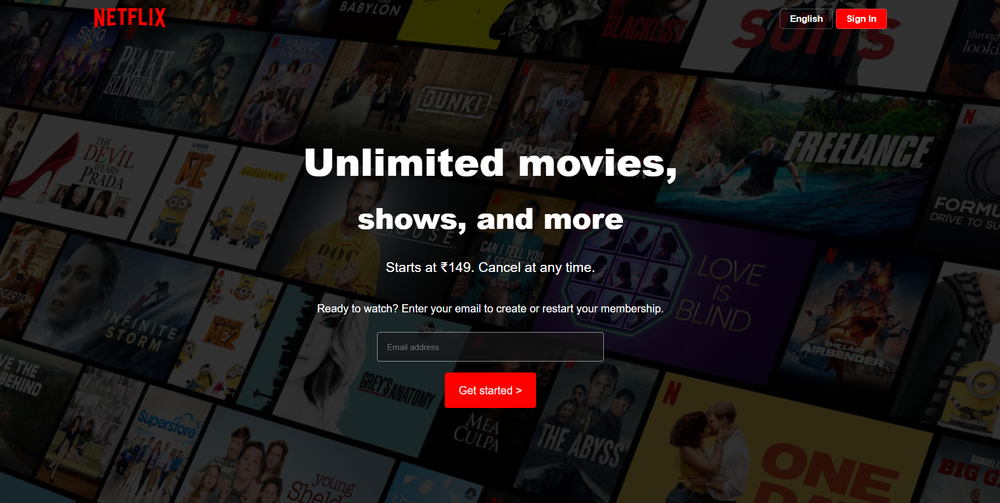
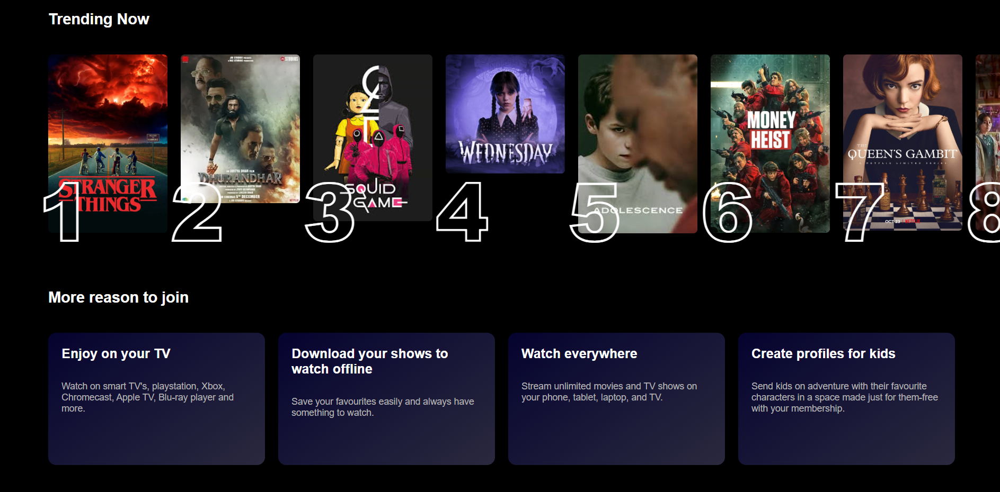
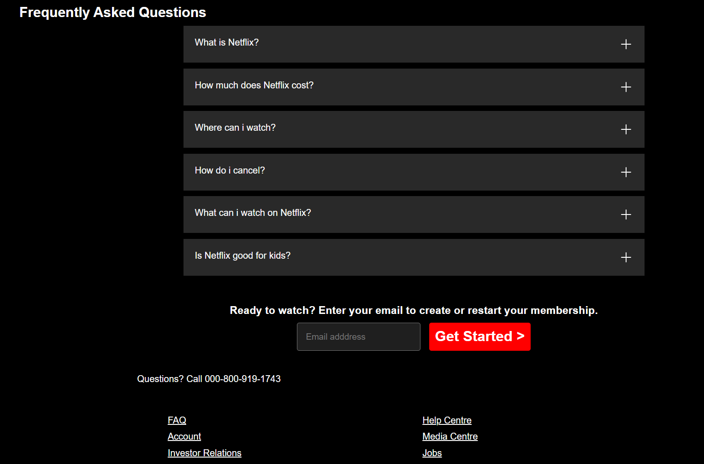

# 🎬 Netflix Clone

A responsive frontend project inspired by the Netflix landing page, built using HTML and CSS.

🔗 Live Demo: https://rishabh-09-eng.github.io/netflix-clone/

---

## 🚀 Features

- Fully responsive layout (mobile, tablet, desktop)
- Modern streaming platform UI design
- Featured content section with call-to-action
- Horizontally scrollable movie section
- Informational feature cards section
- FAQ section (UI only)
- Structured footer with useful links

---

## 🛠️ Tech Stack

- HTML5
- CSS3

---

## 📁 Project Structure
netflix-clone/
│── index.html
│── style.css
│── favicon.ico
│── assets/
└── images/

---

## 📸 Preview

### 🎬 Landing Section

### 🎞 Content & Features

### ❓ FAQ & Footer

---

## 📚 What I Learned

- Creating responsive layouts using Flexbox and Grid
- Handling spacing, alignment, and layout structure
- Building modern UI components
- Improving design consistency
- Deploying a project using GitHub Pages

---

## 🙌 Acknowledgement

This project is inspired by the Netflix landing page for educational purposes.

---

## 👤 Author

**Rishabh**

- GitHub: https://github.com/Rishabh-09-eng

---

⭐ If you like this project, feel free to star it!
